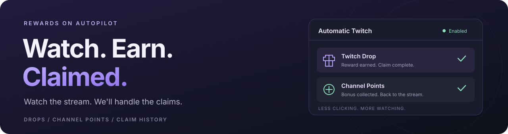

<strong>English</strong> · <a href="README.zh-CN.md">简体中文</a>

<h1 align="center">Automatic Twitch (Manifest V3)</h1>

Automatic Drops and bonus Channel Points, with a record of every claim. Watch your favorite streams. Let the rewards take care of themselves.

  <a href="https://github.com/shockbladenull/automatic-twitch-manifest-v3/releases/latest"><strong>Download the latest release</strong></a> ·
  <a href="#installation">Installation</a> ·
  <a href="https://github.com/shockbladenull/automatic-twitch-manifest-v3/issues">Report an issue</a>

> [!NOTE]
> **Built on Automatic Twitch by EbNull.** This project is an independently maintained Manifest V3 adaptation of **Automatic Twitch: Drops, Moments and Points**, originally created by [EbNull](https://ebnull.org/). [Original extension](https://chromewebstore.google.com/detail/automatic-twitch-drops-mo/kfhgpagdjjoieckminnmigmpeclkdmjm) · [Attribution and licensing](THIRD_PARTY_NOTICES.md).

## Features

### Claim Drops as they become ready

Follow a Drops-enabled stream and let the extension collect rewards once you have earned them. It checks your Twitch inventory and submits available claims automatically, saving you repeated trips to the inventory page and clicks on **Claim**.

### Collect bonus Channel Points

Keep enjoying the stream without watching for the bonus chest. Automatic Twitch claims available Channel Point bonuses for you and records the points collected. Drops and Channel Points have separate switches, so you can automate either or both.

### See what you have collected

Open the extension for recent claims and cumulative totals. Browse rewards by type, see when they were claimed, and check the associated game or channel. The history tracks rewards claimed by the extension, making it easy to see what it has collected for you.

### Make alerts work for you

Choose on-page popups, sound, desktop notifications, or a combination for each reward type. Adjust sound volume and popup duration independently, then preview your choices with built-in test alerts. Keep Drops noticeable and routine point claims quiet—it is your choice.

Claiming is enabled out of the box. Use your existing Twitch login, adjust preferences from the extension popup, and pause automation with the main switch whenever you want. Settings and claim history are saved on your device.

## Installation

1. Download the extension ZIP from [Releases](https://github.com/shockbladenull/automatic-twitch-manifest-v3/releases/latest).
2. Extract it to a folder you want to keep.
3. Open `chrome://extensions` and enable **Developer mode**.
4. Click **Load unpacked** and select the extracted `automatic-twitch-manifest-v3` folder containing `manifest.json`.
5. Open Twitch, refresh any existing stream tabs, and start watching.

**Chrome 116 or newer.** Release ZIPs are ready to load; no build tools or extra downloads are needed.

Pin Automatic Twitch to the toolbar for quick access to claims, statistics, and settings.

When a new release is available, extract its files into the same extension folder, click **Reload** in Chrome, and refresh Twitch.

## Contributing

Bug reports, fixes, and improvements are welcome. See [CONTRIBUTING.md](CONTRIBUTING.md) for development setup, tests, and release publishing.

Maintained by [shockbladenull](https://github.com/shockbladenull).
